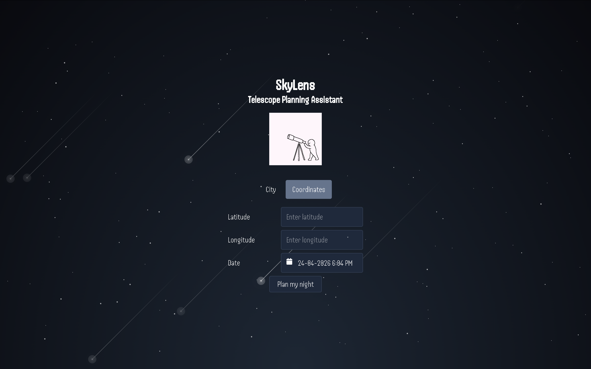
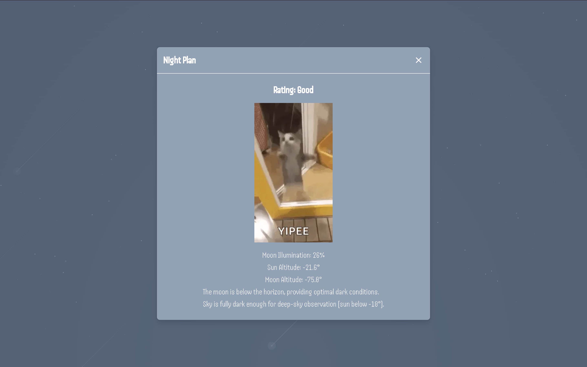

# SkyLens

SkyLens is a telescope planning assistant that helps users plan a stargazing session based on their location and selected date/time.

Users can search by city, enter coordinates manually, choose a date and time, and receive a night plan report that rates the selected stargazing session based on sun altitude, moon altitude, and moon illumination. The result is shown in a themed modal with the calculated conditions and a short explanation of whether the session is good for observing.


## Preview



## Result Example



SkyLens returns a night plan report that includes:

- Stargazing rating, such as Good, Neutral, or Bad
- Moon illumination percentage
- Sun altitude
- Moon altitude
- A short explanation of the observing conditions

## Features

- Search by city or specific location using Nominatim geocoding
- Calculate sun and moon data with SunCalc
- Pick a date and time for the stargazing session with React DatePicker
- Generate a night plan report with a stargazing rating, sun altitude, moon altitude, moon illumination, and an explanation
- Animated starry background
- Telescope-themed pixel UI
- Input validation for location-based planning

## Tech Stack

**Frontend**
- React
- TypeScript
- Tailwind CSS
- CSS
- React DatePicker for date/time selection

**Backend**
- NestJS

**Astronomy & Location**
- SunCalc
- Nominatim geocoding

**Tooling**
- Nx monorepo
- pnpm

## What I Learned

While building SkyLens, I practiced: 

- Using Nx to manage my frontend and backend as one unified project
- Managing form state in React
- Handling conditional UI between city search and coordinate input
- Using geocoding data for location-based planning
- Calculating sun and moon conditions with SunCalc
- Optimizing media files for better performance
- Refactoring and removing unused/debug code
- UI design using CSS animations

## Project Goals

My goal for this project was to build a small but complete full-stack app with an astronomy-related theme, which is a field I am very interested in.

I wanted to improve my full-stack development abilities while exploring a topic that is close to my heart. 

## How It Works

1. The user chooses whether to search by city or enter coordinates manually.
2. The user selects a date and time. 
3. SkyLens processes the selected location and date/time. 
4. The app displays a themed modal that includes a rating, calculated sun/moon conditions, and an explanation of the result.

## Installation

Clone the repository:

```bash
git clone https://github.com/ronishai/SkyLens.git
```

Navigate into the project:

```bash
cd SkyLens
```

Install dependencies:

```bash
pnpm install
```

Run the development server:

```bash
pnpm dev
```

## Future Improvements

- Add weather and cloud coverage data
- Add moon phase information
- Recommend visible planets and deep-sky objects
- Improve mobile responsiveness
- Add light pollution estimation
- Add saved observing sessions

## Author

Built by Roni.